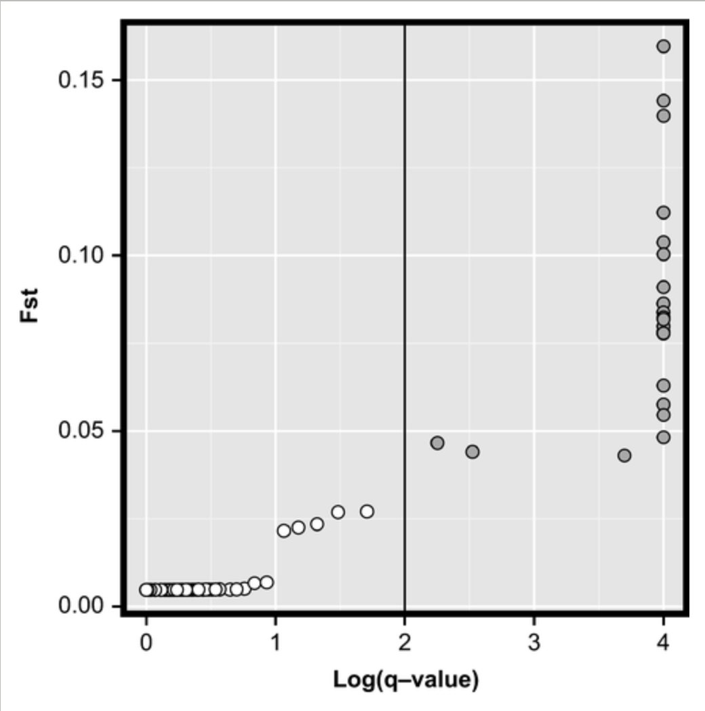

# Codes for the paper : "Seascape genomics provides evidence for thermal adaptation and current‐mediated population structure in American lobster (Homarus americanus)"

#### Laura Benestan

Québec, 2016

Published in Molecular Ecology, 2016, see [Benestan et al](https://onlinelibrary.wiley.com/doi/full/10.1111/mec.13811)

## Description

[Bayescan](http://cmpg.unibe.ch/software/BayeScan/) is a program that aim to identifying **putative candidate loci under natural selection** from genetic data, using differences in allele frequencies between populations. 
BayeScan is based on the [Multinomial-Dirichlet model](https://en.wikipedia.org/wiki/Dirichlet-multinomial_distribution).

This program can define three categories of putative candidate loci:
- under diversifying selection
- under balancing selection
- under neutrality

For each locus, BayeScan calculates a posterior probability (Posterior odds) - available through the parameter `pr_odds` - for the model including selection. These posterior probabilities indicate how more likely the model with selection is compared to the neutral model. For instance a pr_odds of 10 means that there is 1/10 probability for a marker to be under selection.
This number would be too high when considering a datasets up to 10,000 markers.

In the context multiple testing such as large number of markers (up to 10,000), run BAYESCAN with appropriate parameter as recommended in [Whitlock and Lotterhos, 2015](https://www.jstor.org/stable/10.1086/682949?seq=1), you should consider the number of loci in your dataset.

## 1. Run Bayescan in a terminal

**Preparing .geste file**

BayeScan uses its own input file formats that have the extension . geste.
To transform the vcf file (or other formats such as genepop and structure) in a .geste file, you can easily use [PGDSpider2](http://www.cmpg.unibe.ch/software/PGDSpider/)


In bash, use the following command to **run Baeyscan**
```{r} = "bash"
./BayeScan2.1_macos64bits -n 5000 -burn 50000 -pr_odds 10000
```

## 2. Use R to analyse Bayescan results

Using R to visualize the outputs
First, **download libraries**
```{r}
library(ggplot2) 
```

Download Bayescan outputs.
Open the **bayescan output file with the "_fst.txt" extension**. 
```{r}
bayescan=read.table("bayescan-13688snps-562ind.g_fst.txt") 
```

Download the **list of SNPs** in the right order. The .este format has SNPs in the same order than the vcf used to produce the .geste format. Tehrefore, you can use this command in bash to extract the third column containing the ID info of each SNPs in your vcf:
```{r}
 grep -v "#" 13688snps-562ind.recode.vcf | cut -f 3 > 13688snps-562ind_id_vcf.txt
```

Then 
```{r}
SNPb=read.table("13688snps-562ind_id_vcf.txt",header=FALSE) 
```

Merge the name of the outliers with the results from bayescan. 
```{r}
bayescan=cbind(SNPb, bayescan) 
colnames(bayescan)=c("SNP","PROB","LOG_PO","Q_VALUE","ALPHA","FST") 
write.table(bayescan, "13688snps-bayescan-results.txt", quote=FALSE, sep="\t", row.names=FALSE) 
```

Change the value of the Q_VALUE column: 0 == 0.0001.  
```{r}
attach(bayescan)
class(bayescan$Q_VALUE)  
bayescan$Q_VALUE <- as.numeric(bayescan$Q_VALUE) 
bayescan[bayescan$Q_VALUE<=0.0001,"Q_VALUE"]=0.0001 
```

Round the values.  
```{r}
bayescan$LOG_PO <- (round(bayescan$LOG_PO, 4)) 
bayescan$Q_VALUE <- (round(bayescan$Q_VALUE, 4)) 
bayescan$ALPHA <- (round(bayescan$ALPHA, 4)) 
bayescan$FST <- (round(bayescan$FST, 6))
```

Add a column for the type of selection grouping based on a Q-VALUE < 0.05 (you can also choose a Q-VALUE < 0.01). 
```{r}
bayescan$SELECTION <- ifelse(bayescan$ALPHA>=0&bayescan$Q_VALUE<=0.05,"diversifying",ifelse(bayescan$ALPHA>=0&bayescan$Q_VALUE>0.05,"neutral","balancing")) 
bayescan$SELECTION<- factor(bayescan$SELECTION)
levels(bayescan$SELECTION) 
```

**Save the results of the SNPs potentially under positive (divergent) and balancing selection (qvalue < 0.05)**. 
```{r}
positive <- bayescan[bayescan$SELECTION=="diversifying",] 
neutral <- bayescan[bayescan$SELECTION=="neutral",] 
balancing <- bayescan[bayescan$SELECTION=="balancing",]  
```

Check the number of SNPs belonging to each category. 
```{r}
xtabs(data=bayescan, ~SELECTION) 
```

Write the results of the SNPs potentially under selection (qvalue < 0.05). 
```{r}
write.table(neutral, "neutral.txt", row.names=F, quote=F)  
write.table(balancing, "balancing.txt", row.names=F, quote=F) 
write.table(positive, "positive.txt", row.names=F, quote=F) 
```

## 3. Use R to visualize Bayescan results

**Transformation Log of the Q value in order to create te ggplot graph**. 
```{r}
range(bayescan$Q_VALUE) 
bayescan$LOG10_Q <- -log10(bayescan$Q_VALUE) 
```

Create title for the ggplot graph. 
```{r}
x_title="Log(q-value)" 
y_title="Fst" 
```

Make the ggplot graph. 
```{r}
graph_1<-ggplot(bayescan,aes(x=LOG10_Q,y=FST, label=bayescan$POS)) 
graph_1+geom_point(aes(fill=bayescan$SELECTION), pch=21, size=2)+ 
  #geom_text()+ 
  scale_fill_manual(name="Selection",values=c("white","red","orange"))+ 
  labs(x=x_title)+ 
  labs(y=y_title)+ 
  theme(axis.title=element_text(size=12, family="Helvetica",face="bold"), legend.position="none")+ 
  theme(axis.text.x=element_text(colour="black"))+ 
  theme(axis.text.y=element_text(colour="black",size=12))+ 
  theme(axis.text.x=element_text(colour="black",size=12))+ 
  theme(panel.border = element_rect(colour="black", fill=NA, size=3),  
        axis.title=element_text(size=18,colour="black",family="Helvetica",face="bold")) +
        theme_classic()
```
   
Save the file in a pdf format
```{r}
ggsave("bayescan_13688_562ind.pdf", dpi=600, width=5, height=5) 
dev.off()
```



You can also simply use the function already available in Bayescan.
First load the function in R.
```{r}
source("plot_R.r")
```

Make a nice graph using this `plot_bayescan` function.
```{r}
plot_bayescan("sharks.geste_fst.txt")
```
