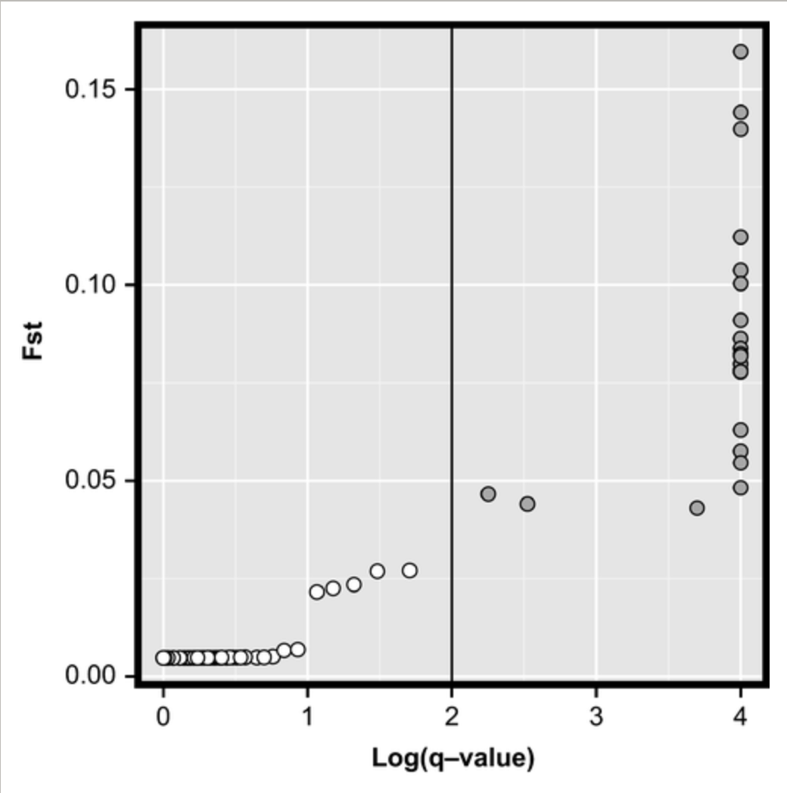

```{r setup, include=FALSE}
knitr::opts_chunk$set(echo = TRUE)
```

BAYESCAN
------------------
------------------

BAYESCAN is a command-line program that aim to identifying **putative candidate loci under natural selection** from genetic data, using differences in allele frequencies between populations. For more details, see:
<http://cmpg.unibe.ch/software/BayeScan/>

BayeScan is based on the [Multinomial-Dirichlet model:
<https://en.wikipedia.org/wiki/Dirichlet-multinomial_distribution>.

This program can define three categories of putative candidate loci:
- under diversifying selection
- under balancing selection
- under neutrality

For each locus, BayeScan calculates a posterior probability (Posterior odds) - available through the parameter `pr_odds` - for the model including selection. These posterior probabilities indicate how more likely the model with selection is compared to the neutral model. For instance a pr_odds of 10 means that there is 1/10 probability for a marker to be under selection.
This number would be too high when considering a dataset with up to 10,000 markers.

In the context multiple testing such as large number of markers (up to 10,000), run BAYESCAN with appropriate parameter as recommended in Whitlock and Lotterhos (2015):
<https://www.jstor.org/stable/10.1086/682949?seq=1>.

To do so, you should consider the number of loci in your dataset. To learn more about how to interpret Bayescan files and outputs, you can also consult the bayescan exercice:
<https://evomics.org/learning/population-and-speciation-genomics/2016-population-and-speciation-genomics/bayescan-exercise/> 

1. Prepare your dataset in the .geste format
------------------

Most of the Next Generation Sequencing (NGS) projects generate a VCF (.vcf) or a PLINK file (.tped and .tfam) after aligning the sequences in [STACKS](http://catchenlab.life.illinois.edu/stacks/). 

The first step is to prepare files in an appropriate .geste format for BAYESCAN.
Convert the .vcf file to a .geste dataset with the function `genomic_converter` available in the elegant `radiator`package in R (see [Thierry Gosselin github page](https://github.com/thierrygosselin) for more details).

2. Download libraries inR environment
------------------

```{r,warning=FALSE, error=FALSE}
library(radiator)
library(vcfR)
library(hierfstat)
```


```{r}
vcfFile <- read.vcfR("filtered_3699snps_californicus.vcf")
```

```{r}
genind <- vcfR2genind(vcfFile)
pop <- read.table("population_map_sea_cucumber.txt", header=TRUE)
genind@pop <- pop$STRATA
```


You can convert the genind file into a bayescan format using radiator.

```{r }
data_fstat <- genind2hierfstat(genind)
```

```{r }
write.bayescan(dat=data_fstat,diploid=TRUE,fn="dat.bsc")
```

3. Use R to identify outliers from Bayescan analyses
------------------

Using R to visualize the outputs
First, **download libraries**
```{r}
library(ggplot2) 
```

Open the **bayescan output file with the "_fst.txt" extension**. 
```{r}
bayescan=read.table("bayescan-13688snps-562ind.g_fst.txt") 
```

The first column of the `bayescan` object is a SNP ID. The next three (prob, log10(P0), and qval) are related to the test of local adaptation considering the logarithm of the posterior odds - log10(PO) - and the q-value for the model with selection. The fifth column gives the size of the locus-specific effect (alpha parameter). The last one provides the locus-specific FST averaged over all populations.

Download the **list of SNPs** in the right order. The .este format has SNPs in the same order than the vcf used to produce the .geste format. Tehrefore, you can use this command in bash to extract the third column containing the ID info of each SNPs in your vcf:

```{r, engine='bash'}
 grep -v "#" 13688snps-562ind.recode.vcf | cut -f 3 > 13688snps-562ind_id_vcf.txt
```

Then 
```{r}
SNPb=read.table("list-13688snps.txt",header=TRUE) 
```

Merge the name of the outliers with the results from bayescan. 
```{r}
bayescan=cbind(SNPb, bayescan) 
colnames(bayescan)=c("SNP","PROB","LOG_PO","Q_VALUE","ALPHA","FST") 
```

Change the value of the Q_VALUE column: 0 == 0.0001.  
```{r}
attach(bayescan)
class(bayescan$Q_VALUE)  
bayescan$Q_VALUE <- as.numeric(bayescan$Q_VALUE) 
bayescan[bayescan$Q_VALUE<=0.0001,"Q_VALUE"]=0.0001 
```

Round the values.  
```{r}
bayescan$LOG_PO <- (round(bayescan$LOG_PO, 4)) 
bayescan$Q_VALUE <- (round(bayescan$Q_VALUE, 4)) 
bayescan$ALPHA <- (round(bayescan$ALPHA, 4)) 
bayescan$FST <- (round(bayescan$FST, 6))
```

Add a column for the type of selection grouping based on a Q-VALUE < 0.05 (you can also choose a Q-VALUE < 0.01). 
```{r}
bayescan$SELECTION <- ifelse(bayescan$ALPHA>=0&bayescan$Q_VALUE<=0.05,"diversifying",ifelse(bayescan$ALPHA>=0&bayescan$Q_VALUE>0.05,"neutral","balancing")) 
bayescan$SELECTION<- factor(bayescan$SELECTION)
levels(bayescan$SELECTION) 
```

**Save the results of the SNPs potentially under positive (divergent) and balancing selection (qvalue < 0.05)**. 
```{r}
positive <- bayescan[bayescan$SELECTION=="diversifying",] 
neutral <- bayescan[bayescan$SELECTION=="neutral",] 
balancing <- bayescan[bayescan$SELECTION=="balancing",]  
```

Check the number of SNPs belonging to each category. 
```{r}
xtabs(data=bayescan, ~SELECTION) 
```

Write the results of the SNPs potentially under selection (qvalue < 0.05). 
```{r}
write.table(neutral, "neutral.txt", row.names=F, quote=F)  
write.table(balancing, "balancing.txt", row.names=F, quote=F) 
write.table(positive, "positive.txt", row.names=F, quote=F) 
```

## 4. Use R to visualize Bayescan results

**Transformation Log of the Q value in order to create te ggplot graph**. 
```{r}
range(bayescan$Q_VALUE) 
bayescan$LOG10_Q <- -log10(bayescan$Q_VALUE) 
```

Create title for the ggplot graph. 
```{r}
x_title="Log(q-value)" 
y_title="Fst" 
```

Make the ggplot graph. 
```{r}
graph_1<-ggplot(bayescan,aes(x=LOG10_Q,y=FST, label=bayescan$POS)) 
graph_1+geom_point(aes(fill=bayescan$SELECTION), pch=21, size=2)+ 
  #geom_text()+ 
  scale_fill_manual(name="Selection",values=c("white","red","orange"))+ 
  labs(x=x_title)+ 
  labs(y=y_title)+ 
  theme(axis.title=element_text(size=12, family="Helvetica",face="bold"), legend.position="none")+ 
  theme(axis.text.x=element_text(colour="black"))+ 
  theme(axis.text.y=element_text(colour="black",size=12))+ 
  theme(axis.text.x=element_text(colour="black",size=12))+ 
  theme(panel.border = element_rect(colour="black", fill=NA, size=3),  
        axis.title=element_text(size=18,colour="black",family="Helvetica",face="bold")) +
        theme_classic()
```
   
Save the file in a pdf format
```{r}
ggsave("bayescan_13688_562ind.pdf", dpi=600, width=5, height=5) 
dev.off()
```



You can also simply use the function already available in Bayescan.
First load the function in R.
```{r}
source("plot_R.r")
```

Make a nice graph using this `plot_bayescan` function.
```{r}
plot_bayescan("bayescan-13688snps-562ind.g_fst.txt")
```

